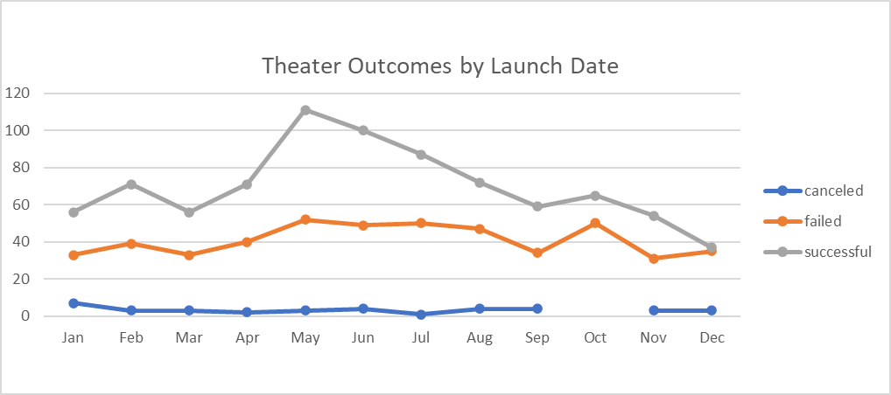
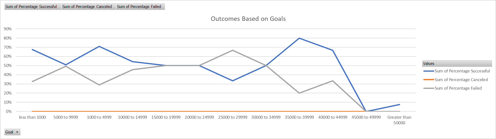

# Kickstarter_Challange

## Overview of Project
In this project I combed through data of various fundraising events throughout the world to make a recommendation to Louise for her own event. I explored the fundamentals of Excel to learn which tools will better help me present my findings to Louise. 

## Purpose 
The purpose of this project was to help Louise with her fundraising campaign. I wanted to determine which month is best suited to launch her event, and which range of fundraising goals were most successful. 

## Analysis
I preformed the analysis by filtering the data, and creating a seperate worksheet for each section. Once the data was pulled, I was able to create a Pivotchart to visualize the results. It’s important to adjust the formatting so that the chart is easy to read, and the results accurately show the findings. 
### Analysis Based on Launch Date
After analyzing the various launch dates, I found that May was the most successful, while December is the least. The graph below confirms these details:

### Analysis Based on Goals
In comparing the ranges of goals for each event, I found that those with a lower goal were more successful than those with a larger goal. $1,000 to $5,000 was the most successful bracket, while $5,000+ was least successful. Details on the chart below: 

## Challenges 
Personally, I did have a hard time getting the columns and rows to output what I needed, but I found that extreme attention to detail is key! Making sure each element in your equation is accurate is the most important factor. Just because you are receiving an output, does not necessarily mean that output is correct. When I came across issues, I was able to search [Excel Jet](exceljet.net) for semi simple solutions. 
